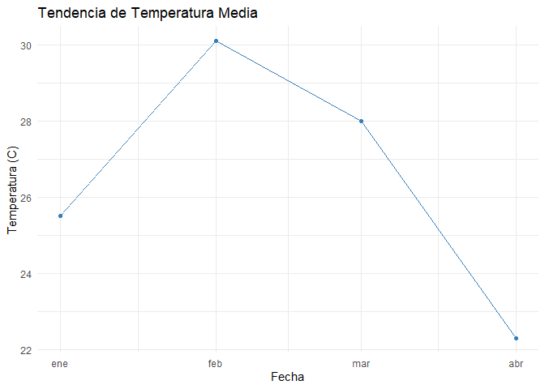

[](https://github.com/Lucas-Descalzo/paqueteMeteo/actions/workflows/R-CMD-check.yaml)

# paqueteMeteo: Análisis de Datos Meteorológicos del SIGA

El paquete `paqueteMeteo` proporciona un conjunto de herramientas
enfocadas en la **lectura, limpieza y resumen** de datos meteorológicos
del sistema SIGA (INTA). Garantiza un flujo de trabajo **reproducible y
estandarizado** para la ciencia de datos.

## Características Principales

Las características clave del paquete incluyen:

- **Lectura de Datos:** Importa fácilmente conjuntos de datos crudos del
  formato SIGA utilizando `siga_read()`.
- **Limpieza de Datos:** Estandariza los nombres de las columnas (p.ej.,
  a minúsculas como `t_max_c`) y asegura que la columna de fecha tenga
  el formato `Date` correcto usando `meteo_clean()`.
- **Análisis y Resumen:** Calcula estadísticas descriptivas clave, como
  la temperatura media y la precipitación total para el período, con la
  función `meteo_summary()`.
- **Visualización Rápida:** Genera un gráfico de tendencia temporal (ej.
  temperatura media) para un análisis visual inmediato usando
  `meteo_plot()`.

El paquete `paqueteMeteo` simplifica el proceso de obtención y trabajo
con datos meteorológicos del SIGA, permitiendo a los usuarios centrarse
en el análisis en lugar de en la preparación de datos.

## Instalación

Puedes instalar la versión de desarrollo desde GitHub con:

``` r
# installemos devtools si es necesario
# install.packages("devtools")
devtools::install_github("Lucas-Descalzo/paqueteMeteo")
#> These packages have more recent versions available.
#> It is recommended to update all of them.
#> Which would you like to update?
#> 
#> 1: All                             
#> 2: CRAN packages only              
#> 3: None                            
#> 4: utf8     (1.2.4 -> 1.2.6) [CRAN]
#> 5: tibble   (3.2.1 -> 3.3.0) [CRAN]
#> 6: purrr    (1.0.2 -> 1.1.0) [CRAN]
#> 7: magrittr (2.0.3 -> 2.0.4) [CRAN]
#> 8: glue     (1.7.0 -> 1.8.0) [CRAN]
#> 
#> ── R CMD build ───────────────────────────────────────────────────────────────────────────────
#>          checking for file 'C:\Users\lucas\AppData\Local\Temp\RtmpiOuFdl\remotes35a01bd25ada\Lucas-Descalzo-paqueteMeteo-00cf9ea/DESCRIPTION' ...  ✔  checking for file 'C:\Users\lucas\AppData\Local\Temp\RtmpiOuFdl\remotes35a01bd25ada\Lucas-Descalzo-paqueteMeteo-00cf9ea/DESCRIPTION' (348ms)
#>       ─  preparing 'paqueteMeteo':
#>    checking DESCRIPTION meta-information ...     checking DESCRIPTION meta-information ...   ✔  checking DESCRIPTION meta-information
#>       ─  checking for LF line-endings in source and make files and shell scripts (365ms)
#>   ─  checking for empty or unneeded directories
#>      Omitted 'LazyData' from DESCRIPTION
#>       ─  building 'paqueteMeteo_0.1.0.tar.gz'
#>      
#> 
```

## Ejemplo de Flujo de Trabajo

Este es un ejemplo reproducible que demuestra el flujo central de
lectura, limpieza, resumen y visualización de datos meteorológicos.

``` r
library(paqueteMeteo)
library(dplyr) # Necesario para el pipe en el chunk de plot

# Se crea un archivo de prueba SIMPLE y estable para la demostración.
ruta_ejemplo <- system.file("extdata", "siga_test_final.csv", package = "paqueteMeteo")

# (Nota: El archivo de ejemplo se incluye dentro del paquete)
```

### 1. Lectura y Limpieza

Se utiliza `siga_read()` para importar los datos crudos y luego
`meteo_clean()` para estandarizar los nombres de columna y forzar el
tipo `Date` en la columna `fecha`.

``` r
datos_crudos <- paqueteMeteo::siga_read(ruta_ejemplo)
datos_limpios <- paqueteMeteo::meteo_clean(datos_crudos)
head(datos_limpios)
#> # A tibble: 4 × 3
#>   fecha       tmed lluvia
#>   <date>     <dbl>  <dbl>
#> 1 2024-01-01  25.5    5  
#> 2 2024-02-01  30.1    1.2
#> 3 2024-03-01  28      0  
#> 4 2024-04-01  22.3   15
```

### 2. Resumen Estadístico

La función `meteo_summary()` calcula la temperatura media y la lluvia
total para el período.

``` r
paqueteMeteo::meteo_summary(datos_limpios)
#> # A tibble: 1 × 2
#>   temp_media lluvia_total
#>        <dbl>        <dbl>
#> 1       26.5         21.2
```

### 3. Visualización de Tendencia

La función `meteo_plot()` genera un gráfico de la tendencia de
temperatura media, utilizando la columna `fecha` para un análisis
temporal rápido.

``` r
# Aseguramos que los datos tengan la columna fecha para el plot
datos_limpios_plot <- datos_limpios |>
    dplyr::mutate(fecha = as.Date(fecha))

paqueteMeteo::meteo_plot(datos_limpios_plot)
```



## Cómo obtener ayuda

Si encuentras un error (bug) o deseas solicitar una nueva
característica, por favor:

1.  Revisa si el problema ya ha sido reportado en nuestro [issue
    tracker](https://github.com/Lucas-Descalzo/paqueteMeteo/issues).
2.  Si no es así, por favor abre un nuevo *issue* con un ejemplo mínimo
    reproducible en
    [GitHub](https://github.com/Lucas-Descalzo/paqueteMeteo/issues/new).
    Incluye:
    - Una descripción detallada del problema.
    - Pasos para reproducirlo.
    - Un ejemplo mínimo reproducible. Example
    - Información sobre tu entorno (versión de R, sistema operativo,
      versión del paquete `paqueteMeteo`).

## Código de Conducta

Por favor, ten en cuenta que el proyecto `paqueteMeteo` se rige por un
[Código de Conducta del Colaborador](CODE_OF_CONDUCT.md). Al contribuir
a este proyecto, aceptas cumplir sus términos.
