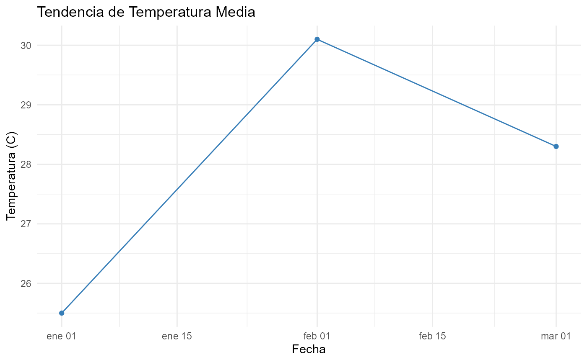

# Introducción-paqueteMeteo

``` r
library(paqueteMeteo)
```

Introducción Este tutorial (o vignette) demuestra el flujo de trabajo
extendido del paquete paqueteMeteo. El objetivo es mostrar cómo leer,
limpiar, analizar y visualizar datos meteorológicos de forma
reproducible.

Flujo de Trabajo Principal Usaremos un archivo de datos de ejemplo
(siga_test_final.csv) que viene incluido en el paquete para simular el
proceso.

``` r
# Creamos un archivo de prueba temporal solo para la vignette
ruta_ejemplo <- "temp_vignette_data.csv"
datos_ejemplo <- data.frame(
    Fecha = as.Date(c("2024-01-01", "2024-02-01", "2024-03-01")),
    T_MAX_C = c(25.5, 30.1, 28.3),
    "lluvia (mm)" = c(5, 1.2, 0)
)
readr::write_csv(datos_ejemplo, ruta_ejemplo)
```

1.  Lectura de Datos (siga_read) Primero, usamos siga_read() para leer
    el archivo CSV. Esta función incluye validaciones para asegurar que
    el archivo exista y no esté vacío.

``` r
datos_crudos <- tibble::tibble(
  fecha  = as.Date(c("2024-01-01","2024-02-01","2024-03-01")),
  `T_MAX_C` = c(25.5, 30.1, 28.3),
  `lluvia (mm)` = c(5, 1.2, 0)
)
```

2.  Limpieza de Datos (meteo_clean) Los datos crudos tienen nombres de
    columna inconsistentes (ej. T_MAX_C). Usamos meteo_clean() para
    estandarizar estos nombres a un formato limpio (ej. tmed) y asegurar
    que la columna fecha sea del tipo Date.

``` r
datos_limpios <- meteo_clean(datos_crudos)
```

3.  Resumen de Datos (meteo_summary) Una vez limpios, podemos calcular
    estadísticos clave con meteo_summary().

``` r
meteo_summary(datos_limpios)
#> # A tibble: 1 × 2
#>   temp_media lluvia_total
#>        <dbl>        <dbl>
#> 1       28.0          6.2
```

4.  Visualización (meteo_plot) Finalmente, usamos meteo_plot() para
    generar un gráfico rápido de la tendencia de temperatura.

``` r
meteo_plot(datos_limpios)
```


